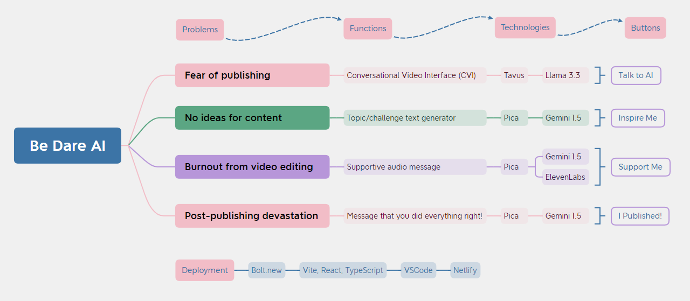

# Be Dare AI – The Ultimate Content Creator Companion


Are you a content creator struggling with fear of publishing, a lack of content ideas, editing burnout, or post-publishing devastation? Be Dare AI is your go-to supportive AI tool designed to empower you through every stage of your creative journey. Get the encouragement, real-time video chat with AI coach for bloggers, and affirmation you need to overcome challenges and thrive.

🛠️ _Built as an MVP for the_ [**World’s Largest Hackathon by Bolt**](https://worldslargesthackathon.devpost.com/).

## Features

| Feature                        | Button         | Description                                                                                                      |
|-------------------------------|----------------|------------------------------------------------------------------------------------------------------------------|
| Conversation with Persona     | Talk to AI     | Your personal AI guide support coach from Tavus, providing constant encouragement and feedback.                 |
| Content Idea Generator        | Inspire Me     | Overcome creative blocks and “No ideas for content” with AI-powered topic and challenge suggestions.            |
| Supportive Audio Messages     | Support Me     | Combat “Editing burnout” with uplifting and calming audio, generated by Gemini and synthesized via ElevenLabs.  |
| Post-Publishing Affirmation   | I Published!   | Receive a motivating message from AI to help ease post-publishing emotional drop.      |

> Seamless Experience: Adaptive UI for an easy start, no registration required – just open and act!

## ⚡ Technologies

Be Dare AI is proudly built with modern and efficient technologies:

-   **Framework:** Vite + React + TypeScript
-   **Styling:** Tailwind CSS
-   **AI Integrations:**
    - **Pica** – used to design custom API agents and route requests to:
        -   **Gemini 1.5 Flash** for dynamic message and idea generation
        -   **ElevenLabs** for realistic voice synthesis
    - **Tavus** for Conversational Video Interface (CVI)
- **Development Workflow:**
  - Initial prototyping with **Bolt.new**’s visual editor
  - Full development and integration done locally in **VSCode**

## 🌐 Architecture




## 🚀 Getting Started

To run Be Dare AI locally:

1.  Clone the repository.
2.  Install dependencies:

```bash
npm install
```

3. Fill in the necessary keys: open `.env.example` as example, and create `.env`.

4.  Start the development server:
```bash
npm run dev
```

## License

This project is licensed under the MIT License. See the [LICENSE](LICENSE) file for details.